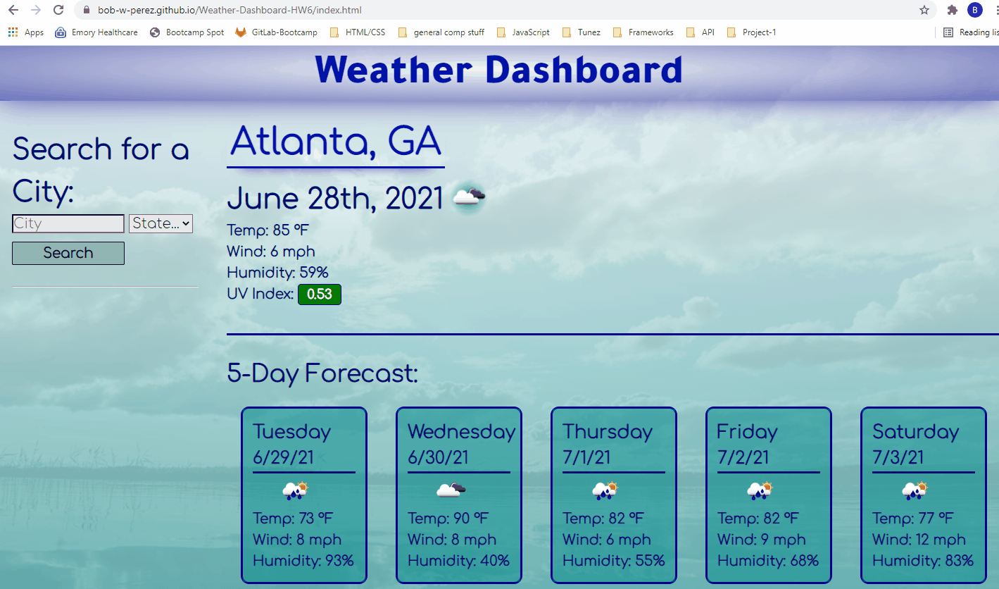
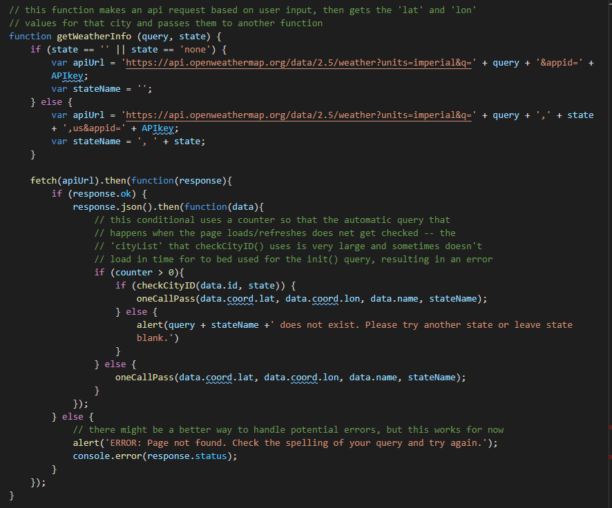
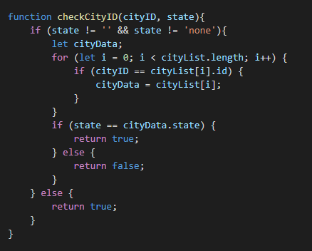

# Weather-Dashboard

- This project was to make a weather app that retrieved data from the OpenWeatherMap API based on user input, then displayed some of the current and forecast data to the user

- The project only required the user to input a city (no state input) and the API would return the largest city with that name. However, since there are multiple cites with the same name, I added a feature for the user to be able to specify a state. This input is not required and the user can leave it blank if they choose, giving them the option of a higher quality experience but not forcing them to use it.

- HTML, CSS, JavaScript, Moment.js, Google Fonts
## Installation

No installation required.
Go to [https://bob-w-perez.github.io/Weather-Dashboard-HW6/](https://bob-w-perez.github.io/Weather-Dashboard-HW6/) to use the application.

The code and all relevant files can be found at [https://github.com/bob-w-perez/Weather-Dashboard-HW6](https://github.com/bob-w-perez/Weather-Dashboard-HW6). 

## Usage

## Features

- user can input a city and an optional state specification and is then presented with the current weather data and the forecasted data for the next five days

- the user's searches are saved in local storage and displayed as a list of search history items beneath the search input fields

- *EXTRA* the state input was not required but gives the user a better experience in situations where they do not want the default city of a given name to be displayed, but the logic is constructed so if they do not want to enter an additional state parameter the query will only use the city and not throw any errors

- if the user inputs a city that is misspelled or does not exist (e.g., Atlanta, CO), they are prompted to try again with a new query

- relaxing yet professional color scheme, fonts and background for optimal user experience

## Selected Code
 

- When the user submits their query the 'getWeatherInfo' function makes the API request with the appropriate url construction depending on whether or not the user selected a state parameter.

 

- The 'checkCityID' function ensures that, if the user input a state along with their city query, the city/state combination actually exists. This was a necessity because the OpenWeatherMap API will not throw any errors for a city/state query that does not exist but instead returns the data for their default for a given city name (e.g. 'Atlanta, CO' does not exist but returns the data for Atlanta, GA). The check uses the unique city ID number of the returned data from 'getWeatherInfo' to find that city in a database of all cities used be OpenWeatherMap (cityList), then compares the state input by the user to the state in the database.

 

## Contributing
Solo project for GATech Coding Bootcamp
by Rob Perez
- [Portfolio Page]https://bob-w-perez.github.io/Portfolio-Page/)
- bob.w.perez@gmail.com
- 404.317.5336

 

## License
MIT License

Copyright (c) 2021 Robert Perez

Permission is hereby granted, free of charge, to any person obtaining a copy
of this software and associated documentation files (the "Software"), to deal
in the Software without restriction, including without limitation the rights
to use, copy, modify, merge, publish, distribute, sublicense, and/or sell
copies of the Software, and to permit persons to whom the Software is
furnished to do so, subject to the following conditions:

The above copyright notice and this permission notice shall be included in all
copies or substantial portions of the Software.

THE SOFTWARE IS PROVIDED "AS IS", WITHOUT WARRANTY OF ANY KIND, EXPRESS OR
IMPLIED, INCLUDING BUT NOT LIMITED TO THE WARRANTIES OF MERCHANTABILITY,
FITNESS FOR A PARTICULAR PURPOSE AND NONINFRINGEMENT. IN NO EVENT SHALL THE
AUTHORS OR COPYRIGHT HOLDERS BE LIABLE FOR ANY CLAIM, DAMAGES OR OTHER
LIABILITY, WHETHER IN AN ACTION OF CONTRACT, TORT OR OTHERWISE, ARISING FROM,
OUT OF OR IN CONNECTION WITH THE SOFTWARE OR THE USE OR OTHER DEALINGS IN THE
SOFTWARE.
